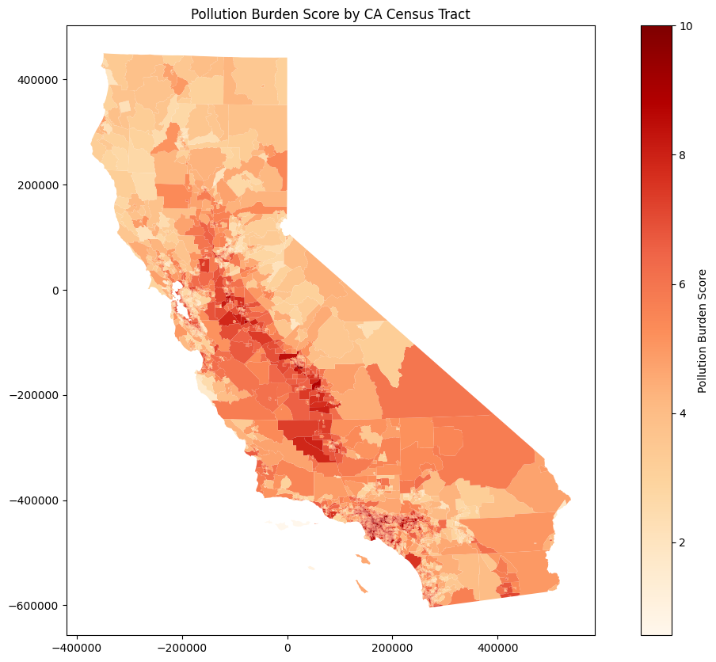

# Visualizing Pollution Burden & Income by CA Census Tract 🗺️

## Authors
**Shivani Manivasagan, Kai Rieffel, Subi Lumala**

## Date
November 2023 - December 2023

## Summary
This project provides a comprehensive tutorial on overlaying pollution burden scores and median income data on a map of California. The goal is to identify census tracts that are disproportionately affected by pollution. We use `pandas`, `geopandas`, `matplotlib`, and `numpy` to plot the data on a map, using shapefiles containing census tract geometry. This tutorial guides users through each step of the process (importing datasets, preprocessing/merging data, making visualizations), making it accessible for those new to geospatial analysis.

## Sample Visualization

## Datasets

### Pollution Burden Score:
[CalEnviroScreen](https://oehha.ca.gov/calenviroscreen/report/calenviroscreen-40) is an online tool created by the California Office of Environmental Health Hazard Assessment. It allows users to visualize various environmental parameters by census tract on a map of California. The dataset contains multiple parameters; we focus on the *Pollution Burden Score*, which measures the overall pollution exposure of a tract.

### Median Income:
The US Census Bureau collects [data](https://data.census.gov/) for census tracts across the United States on various parameters, such as race, commute time, and income. For this project, we use the 2022 5-year estimates for median household income, which aggregate data collected from January 1, 2018, to December 31, 2022, for each California census tract.
